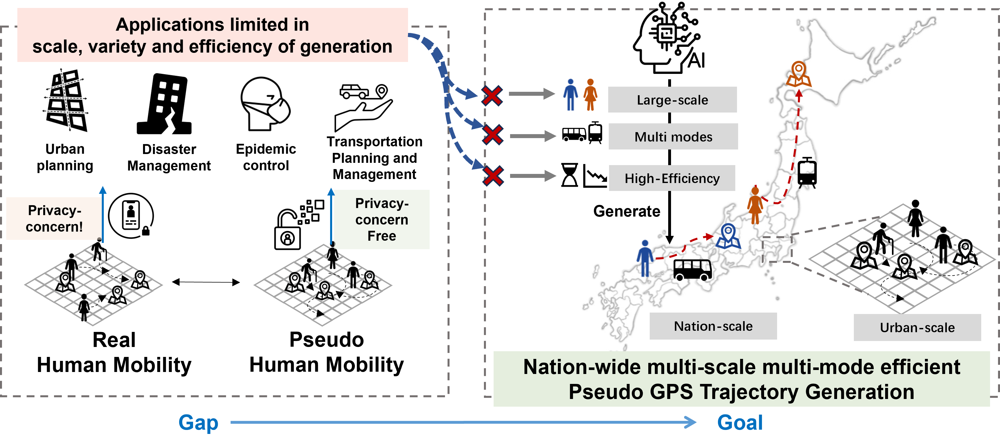

# TrajFlow: nationwide Pseudo GPS Trajectory Generation with Flow Matching Models

This repository is the  implementation of paper **TrajFlow: nationwide Pseudo GPS Trajectory Generation with Flow Matching Models**.



## Paper
TrajFlow is a flow-matching based framework for pseudo GPS trajectory generation targeting multi-scale mobility patterns.

- OpenReview page: https://openreview.net/forum?id=BDOldEjwCE
- PDF: https://openreview.net/pdf?id=BDOldEjwCE

## Data Availability
- This repository provides the training and inference pipeline for TrajFlow.
- The main paper conclusions are validated on **BW** data, which is commercial/private and not open-sourced here.
- We do **not** redistribute DiDi datasets due to policy restrictions. Please obtain data from official/authorized channels under your own compliance responsibility.
- A toy synthetic toy dataset is included only to demonstrate the expected processed data format and support smoke tests.

Expected local layout for testing:
 - `./data/toy_data`
- `./data/DiDiTaxi_Chengdu_traj`
- `./data/DiDiTaxi_XiAn_traj`

See `data/README.md` for the processed file schema.

## Setup
```bash
conda env create -f environment.yml
conda activate flow_matching_py311
pip install -r requirements.txt
```

Notes:
- `flow_matching` is installed as an external dependency via `requirements.txt`.
- This repository does not vendor a local `flow_matching/` copy.

## Usage

Toy-data smoke test:
```bash
python data/make_toy_data.py
python train.py --config ./src/config/config_toy.yaml
```

Training:
```bash
python train.py --config ./src/config/config_chengdu.yaml
# XiAn:
# python train.py --config ./src/config/config_xian.yaml
```

Generation:
```bash
python generate.py \
  --config ./outputs/run_YYYYMMDD_HHMMSS/config.yaml \
  --checkpoint ./outputs/models/run_YYYYMMDD_HHMMSS/best_model.pt
```

## License
Unless otherwise noted, the original code in this repository is released under **CC BY-NC 4.0** (`LICENSE`).

This repository also includes third-party code under separate licenses. For example, `src/utils/jismesh_v2/` is distributed under the **MIT License**; see `src/utils/jismesh_v2/LICENSE`.

## Citation
If you use this repository, please cite:

```bibtex
@inproceedings{li2026trajflow,
  title={TrajFlow: nationwide Pseudo GPS Trajectory Generation with Flow Matching Models},
  author={Li, Peiran and Wang, Jiawei and Zhang, Haoran and Shi, Xiaodan and Koshizuka, Noboru and Shimizu, Chihiro and Jiang, Renhe},
  booktitle={International Conference on Learning Representations (ICLR)},
  year={2026},
  url={https://openreview.net/forum?id=BDOldEjwCE}
}
```
